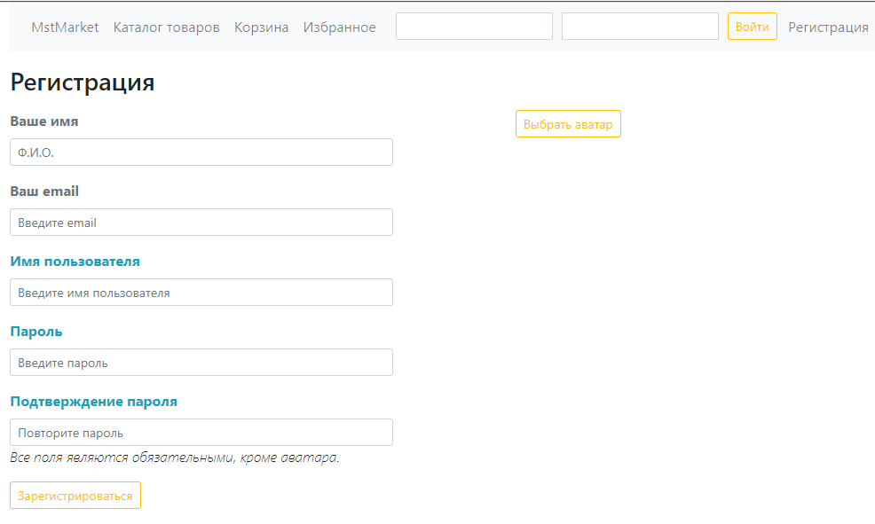
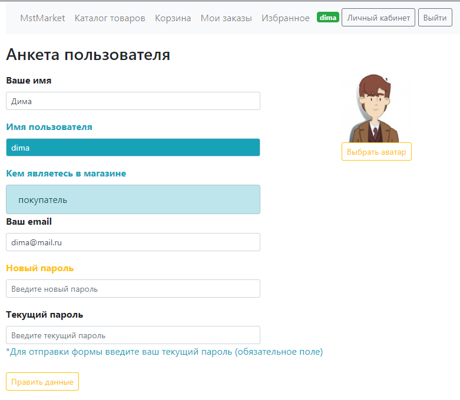

# Проект 

### интернет-магазин MstMarket

# Цель

Расширить возможности существующего проекта интернет-магазина новым функционалом  в зависимости от предпочтений заказчика на основе job-story и user-story. Интернет-магазин должен быть доступен в браузере через интернет.

Интернет-магазин предоставляет любому посетителю следующие возможности.
- Просматривать каталог товаров с возможностью фильтрации товаров по цене, названию и категории.
- Просматривать карточки товаров с подробным их описанием и изображением.
- Просматривать отзывы о товарах и среднюю оценку покупателей по каждому товару.
- Регистрироваться в качестве нового покупателя, если посетитель не вошёл в магазин.
- Входить в магазин в случае наличия личного кабинета.
- Пользоваться корзиной.
- Помещать товары в Избранное и удалять их оттуда.
- Выходить из магазина ранее вошедшему в магазин посетителю.

Интернет-магазин предоставляет менеджерам следующие возможности:
- Редактировать состав товаров и их свойства:
  - Редактировать карточку товара с подробным описанием его потребительских свойств.
  - Удалять товар из каталога.
  - Создавать новые карточки товаров с подробным описанием их потребительских свойств.
- Делать email-рассылки о возврате товаров в продажу после временного их отсутствия.
- Загружать и удалять изображения товаров.

Интернет-магазин предоставляет администраторам следующие возможности:
- Просматривать список пользователей магазина.
- Блокировать, разблокировать доступ конкретным пользователям к магазину.
- Удалять отзывы покупателей о товарах.

Интернет-магазин предоставляет супер админу следующие возможности:
- Назначать роли пользователям из следующего списка:
    - администратор,
    - менеджер.

Интернет-магазин предоставляет покупателям следующие возможности:
- Пользоваться личным кабинетом.
  - Просматривать и редактировать свои персональные данные:
    - Ф.И.О.,
    - адрес электронной почты. 
  - Изменять пароль.
  - Просматривать
    - своё имя пользователя (ник),
    - кем владелец личного кабинета является в магазине.
  - Загружать и просматривать свой аватар.
- Оставлять и редактировать свои отзывы.
- Создавать, просматривать и удалять свои заказы.
- Подписываться на уведомления о поступлении временно отсутствующих товаров в продажу.

Пользователь интернет-магазина может быть менеджером, администратором и покупателем одновременно. Супер админ обладает всеми правами менеджера, администратора и покупателя. Супер админ не может быть заблокирован.

----

### Пользовательские роли
- Покупатель,
- Менеджер,
- Администратор,
- Супер админ,
- Гость

Покупатель просматривает товары из каталога, добавляет их в корзину, оформляет и просматривает свои заказы, может подписаться на email-рассылку о возврате временно отсутствующего товара в продажу. Это зарегистрированный пользователь, прошедший процедуру аутентификации.
Менеджер добавляет новые товары, редактирует, удаляет из каталога существующие и делает рассылку о возврате товаров в продажу, подписавшимся на это пользователям.
Администратор занимается модерацией отзывов покупателей о товарах, блокирует пользователей, нарушающих правила интернет-магазина.
Супер админ назначает менеджеров и администраторов, чтобы они управляли магазином.
Гость просматривает товары из каталога, добавляет их в корзину, но не имеет возможности оформить заказ, потому что не зарегистрирован или не прошёл процедуру аутентификации.

----

# Технологии
В проекте используются следующие технологии:
* AngularJS
* Redis
* Lombok
* Java 17
* Spring Boot
* Spring Cloud Gateway
* Spring Web Service
* Spring WebFlux
* Spring Security
* Spring Data MongoDB
* Spring Data Redis
* Spring Data JPA
* JUnit
* Flyway Migration
* MongoDB
* Docker
* PostgreSQL
* Swagger
* Maven
* Java Mail Api

----

# Запуск приложения
* ### Запуск интернет-магазина из IntelliJ IDEA

1. [Клонировать репозиторий.](https://github.com/DVPeshe/Scrum.git) Важно, чтобы папка локального репозитория называлась Scrum.
2. Выполнить команды maven clean install в IntelliJ IDEA.
3. В IntelliJ IDEA из файла docker-compose.yml запустить postgres, redis и mongo.
4. В IntelliJ IDEA в терминале во вкладке меню Terminal скопировать изображения аватаров в докер с помощью команд:

docker cp ./images/bob.jpg scrum-postgres-1:/var/lib/postgresql/data

docker cp ./images/john.jpg scrum-postgres-1:/var/lib/postgresql/data

docker cp ./images/artur.jpg scrum-postgres-1:/var/lib/postgresql/data

5. В IntelliJ IDEA из файла docker-compose.yml запустить flyway.
6. В IntelliJ IDEA во вкладке меню Services запустить все микросервисы.
7. Открыть клиентское приложение в браузере http://localhost:3000/market-front.

----

# Основные возможности проекта

* ### Регистрация
[Любой посетитель интернет-магазина, у которого нет личного кабинета, может зарегистрироваться, чтобы стать покупателем.](https://disk.yandex.ru/i/YnwG3oo4tG481A)

* ### Личный кабинет
[Пользователь, вошедший в интернет-магазин, может просматривать и редактировать свои персональные данные.](https://disk.yandex.ru/i/hetb_c_pZU4KOA)

* ### Уведомление подписавшихся пользователей о событиях интернет-магазина по электронной почте

Возможность подписки на событие появления товара в продаже после временного его отсутствия. 
После появления товара в продаже происходит массовая рассылка на электронную почту подписавшимся на это событие.
Подписаться может любой зарегистрированный пользователь интернет-магазина.

Инициирует рассылку менеджер в разделе редактирование продуктов.

Подписавшийся пользователь получает электронное письмо с уведомлением о возврате товара в продажу на указанный им электронный адрес.

